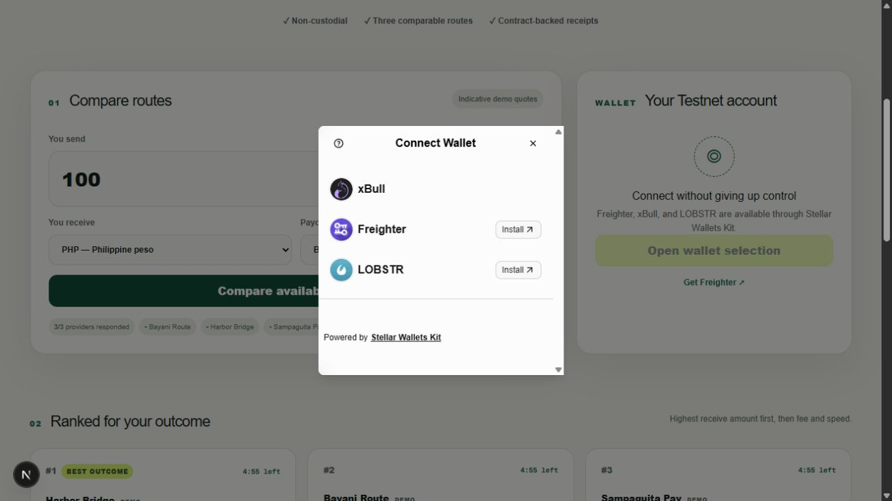
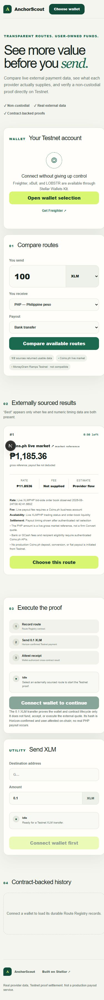

# AnchorScout

[](https://github.com/zaejohn/AnchorScout/actions/workflows/ci.yml)

AnchorScout is a non-custodial Stellar Testnet route-comparison dApp. It compares normalized external provider data, distinguishes firm quotes from market references, records a selected route on Soroban, and completes a separate real XLM proof flow with public receipt evidence.

The product solves a simple problem: payment routes expose different rates, fees, speed, and availability, but those differences are hard to compare consistently. AnchorScout isolates each provider behind one adapter interface, validates and normalizes responses server-side, and never invents a missing fee, settlement time, or provider capability. Incomplete routes remain visible and attributed but cannot receive a "Best" badge.

## Evidence at a glance


| Wallet selection | Mobile route comparison |
| --- | --- |
|  |  |

The screenshots are from the locally running production-shaped application. Public Testnet transactions below provide the authoritative route/payment/receipt evidence. A connected extension wallet screenshot remains a physical-browser step because the available verification browser has no Stellar wallet installed.

## How it works

1. Connect Freighter, xBull, or LOBSTR through Stellar Wallets Kit on Testnet.
2. Load XLM and configured asset balances from Horizon.
3. Submit a validated route request to the Next.js backend.
4. Query Coins.ph live market data, MoneyGram Testnet capability, and any configured SEP-38 endpoint concurrently.
5. Normalize provenance, missing fields, expiry, settlement mode, and deterministic ranking.
6. Sign a Route Registry invocation with the user's wallet.
7. Sign and confirm a real classic XLM payment.
8. Sign a Settlement Receipt invocation. That contract atomically invokes Route Registry and finalizes the route.
9. Poll contract events and reload durable contract-backed history.

AnchorScout never holds funds, requests secret keys, accepts a production provider quote, or signs for users. The external PHP payout remains simulated on Testnet and is explicitly separate from the 0.1 XLM proof payment. The classic payment hash is confirmed through Horizon by the app and user-attested on-chain because Soroban cannot independently query classic transaction history.

## Architecture

```text
Browser wallet + responsive client
        │
        ├── Next.js Route Handlers ── provider registry ── Coins.ph / MoneyGram / SEP-38
        │                                  │
        │                                  └── normalization + deterministic ranking
        │
        ├── Horizon ── balances, classic XLM submission, payment confirmation
        │
        └── Stellar RPC ── simulation, wallet signing, contract submission, events
                                  │
                    Route Registry contract
                                  ▲
                                  │ atomic authenticated invocation
                    Settlement Receipt contract
```

- `web/src/lib/anchors/`: request schema, provider interface, adapters, normalization, ranking, and tests
- `web/src/lib/stellar/`: Testnet config, Wallets Kit, retry-safe classic/contract lifecycles, generated-contract wrappers, and history synchronization
- `web/src/app/api/`: quote, account, event, transaction-status, and history boundaries
- `contracts/route-registry/`: wallet-owned route records and final-state transitions
- `contracts/settlement-receipt/`: globally unique receipts and authenticated cross-contract finalization
- `web/src/lib/stellar/generated/`: generated TypeScript bindings from deployed contract specs

See `ARCHITECTURE.md` for boundaries and invariants and `DECISIONS.md` for durable design choices.

## Setup

### Requirements

- Node.js 22+
- pnpm 11+
- Rust 1.96+ with `wasm32v1-none`
- Stellar CLI 27+
- Docker only if local Quickstart RPC testing is desired

### Install and run

```powershell
cd web
Copy-Item .env.example .env.local
pnpm install --frozen-lockfile
pnpm dev
```

Set these public Testnet values in `web/.env.local`:

```dotenv
NEXT_PUBLIC_STELLAR_HORIZON_URL=https://horizon-testnet.stellar.org
NEXT_PUBLIC_STELLAR_RPC_URL=https://soroban-testnet.stellar.org
NEXT_PUBLIC_ROUTE_REGISTRY_CONTRACT_ID=CBYCCXCJLFQKUIPNJDQNXXIGV26S4FSXGHRYQQBPU3EYUGE6EXRRDZ5H
NEXT_PUBLIC_SETTLEMENT_RECEIPT_CONTRACT_ID=CBQKALTRUEBNTDOKL7UOOSEFPJMHZRQCWV5C6VZA4T3TO4WEB2OIBDJM
NEXT_PUBLIC_PROOF_PAYMENT_DESTINATION=GDW2INHQPIWK6JYMVDPCT3JZHMBSYPDEWB56PCRC2JSXADAF22VF253M
```

No provider credential is required for live Coins.ph `XLMPHP`/`USDCPHP` market-reference results or MoneyGram Testnet capability checks. The public market adapter values the requested amount against the bid-side order book, so visible-depth slippage is included.

The repository includes a tested authenticated Coins.ph adapter that requests a firm Convert quote and live `support-channel` fee, status, limits, and eligible rail. It is intentionally not registered on the anonymous public quote endpoint. A production deployment must first add user or tenant authorization, durable rate limiting, and narrowly scoped business credentials; server-only keys alone do not make a public proxy safe. The adapter never accepts the quote or calls cash-out.

Optional `SEP38_ANCHOR_HOME_DOMAIN` and `SEP38_ANCHOR_NAME` enable a real indicative SEP-38 provider. The adapter discovers `ANCHOR_QUOTE_SERVER` through SEP-1, requires HTTPS, and only calls the home origin or origins explicitly listed in `SEP38_ALLOWED_QUOTE_ORIGINS`.

## Provider and test-environment status

| Provider | Data used now | Test environment | AnchorScout behavior |
| --- | --- | --- | --- |
| Coins.ph | Live public market status and bid depth; protected authenticated adapter implemented but not publicly registered | No public end-to-end Stellar/fiat sandbox documented | Production data is read-only; fiat execution is simulated on Testnet |
| MoneyGram Ramps | Live Testnet SEP-1 and SEP-24 USDC capability/limits | Yes: Stellar Testnet anchor | Hosted cash is real Testnet capability; requested bank/GCash step is simulated and PHP rate is separately attributed to Coins.ph |
| Configured SEP-38 anchor | Live SEP-1 discovery and `/price` response | Provider-specific | Indicative, comparison-only unless the provider supplies a compatible endpoint |
| Onramper | Not enabled | Staging exists, but current probes returned no Stellar-to-PHP sell provider | Excluded until authenticated coverage proves the corridor |
| TransFi | Not enabled | Credentialed sandbox exists | Excluded until capability APIs prove Stellar XLM/USDC-to-PHP coverage |

Primary sources: [Coins.ph REST API](https://docs.coins.ph/rest-api/), [Coins.ph Business](https://www.coins.ph/en-ph/business), [MoneyGram Stellar integration](https://xramps.moneygram.com/ops/dev/stellar), [Onramper sell quotes](https://docs.onramper.com/reference/get_quotes-crypto-fiat), and [TransFi exchange rates](https://docs.transfi.com/reference/get-exchange-rates).

### Verification

```powershell
cd web
pnpm lint
pnpm typecheck
pnpm test
pnpm build

cd ..\contracts
cargo test --workspace --locked
stellar contract build --optimize
```

Verified release result:

- ESLint: passed
- TypeScript: passed
- Frontend/domain tests: 78 passed across 12 files
- Next.js 16.3.2 production build: passed
- Soroban tests: 16 passed
- Optimized contract builds: passed
- Contract specialist re-review: no release-blocking findings
- Desktop and 390 px mobile browser checks: passed

The same gates are encoded in `.github/workflows/ci.yml`. [GitHub Actions run #4](https://github.com/zaejohn/AnchorScout/actions/runs/32699582208) passed both the web and contract jobs on the pushed implementation.

### Deploy contracts to Testnet

```powershell
powershell -ExecutionPolicy Bypass -File scripts\deploy-testnet.ps1
```

The script retests and rebuilds exact optimized artifacts, creates/funds a secure-store deployer identity, deploys both contracts, configures the one-shot settlement authority, smoke-reads state, and regenerates TypeScript bindings. No secret is written to the repository.

## Stellar Testnet

| Item | Public identifier |
| --- | --- |
| Route Registry | [`CBYCCX…RDZ5H`](https://lab.stellar.org/r/testnet/contract/CBYCCXCJLFQKUIPNJDQNXXIGV26S4FSXGHRYQQBPU3EYUGE6EXRRDZ5H) |
| Settlement Receipt | [`CBQKALT…IBDJM`](https://lab.stellar.org/r/testnet/contract/CBQKALTRUEBNTDOKL7UOOSEFPJMHZRQCWV5C6VZA4T3TO4WEB2OIBDJM) |
| Route selection | [`c1875852…c1d2`](https://stellar.expert/explorer/testnet/tx/c18758523958bcb4738664364bbd401a8fe225f46f3b68efc324bbb4ad41c1d2) |
| Confirmed 0.1 XLM payment | [`707e08de…b164`](https://stellar.expert/explorer/testnet/tx/707e08de52ba122c2d9ae992bf3a9c0d03b58f7d39ebd194f993ef3fe091b164) |
| Receipt + cross-contract finalization | [`eefe216d…d93a`](https://stellar.expert/explorer/testnet/tx/eefe216d59c3a7123a1a59a18e5edd660478c2ab3becb0ec06e930657467d93a) |

The final public reads return a `Completed` route and `Completed` receipt linked to the same payment hash. `NETWORKS.md` contains complete artifact hashes, deployment transactions, IDs, asset scope, and reset guidance.

## Operational status

- Mainnet is disabled and was not touched.
- Native XLM is the executable Testnet proof asset. Test USDC comparison is enabled, but execution remains disabled until an issuer and asset-payment path are configured.
- Vercel Web Analytics is included in the root layout, with non-sensitive quote/route lifecycle events.
- `/api/health` probes Horizon, RPC, protocol/ledger visibility, and public contract configuration for deployment monitoring.
- Production Vercel deployment is ready but requires `vercel login` or a deployment token; this workstation is logged out.
- The in-app browser verified wallet discovery, route comparison, expiration countdowns, mobile responsiveness, and no horizontal overflow. Signing with a real extension wallet remains a human-controlled browser action.

## Security notes

- The browser is untrusted; route input is validated again at the server boundary.
- Wallet signatures remain user-controlled.
- Submission and confirmation are separate states; broadcast hashes are checkpointed before confirmation and reconciled after reload without automatic resubmission.
- Configured SEP-38 HTTPS origins are resolved, public-address validated, DNS-pinned per request, response-bounded, and forbidden from redirecting.
- Contract settlement authority is configured exactly once.
- Receipt IDs are globally unique, and a failed nested Registry invocation rolls back Receipt storage atomically.
- No bank, KYC, seed, private key, or sensitive payout data is stored or emitted.
